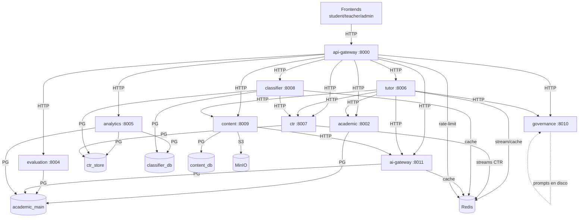

# Mapa del deploy real — AI-Native (prod)

> **Artefacto Fase 0** del [`PLAN-AUDITORIA-RESILIENCIA.md`](PLAN-AUDITORIA-RESILIENCIA.md).
> Grafo construido el **2026-06-04** leyendo las env vars **reales** de cada servicio en
> EasyPanel (no los diagramas de los `.md`). VPS `187.77.41.214`, EasyPanel v2.30.1,
> proyecto `ai_native`, 4 cores / 15.6 GB.
>
> ⚠️ **Riesgo base conocido:** RAM del host al **82.8% en idle**.

---

## Grafo de dependencias (deploy real)

> Todas las DBs lógicas viven en **un solo Postgres**. Casi todos usan **Redis db0**
> (api-gateway usa db4 para rate-limit). MinIO es único.

---

## Tabla servicio → dependencias (saliente)

| Servicio | Puerto | Llama por HTTP a | Datos (PG / Redis / S3) | RAM idle* |
|---|---|---|---|---|
| **api-gateway** | 8000 | los **9** backends | redis db4 (rate-limit) | ~82 MB |
| **tutor** | 8006 | ai-gateway, academic, ctr, content, governance | redis db0 | ~87 MB |
| **ctr** | 8007 | — | ctr_store + redis db0 | **~534 MB** 🔴 |
| **classifier** | 8008 | ctr | classifier_db + ctr_store + redis | ~50 MB |
| **content** | 8009 | ai-gateway | content_db + **MinIO** | ~39 MB |
| **ai-gateway** | 8011 | — | **academic_main** + redis | ~38 MB |
| **analytics** | 8005 | — | **academic_main + ctr_store + classifier_db** | ~86 MB |
| **academic** | 8002 | — | academic_main | ~106 MB |
| **evaluation** | 8004 | — | academic_main | ~75 MB |
| **governance** | 8010 | — | **nada** (prompts de disco) | ~18 MB |

\* *idle medido 2026-06-04 antes del redeploy de la Fase 6.*

**Infra compartida:** Postgres (4 DBs: `academic_main`, `ctr_store`, `classifier_db`, `content_db`, ~117 MB) · Redis (~7 MB) · MinIO (~100 MB).

---

## Hallazgos del mapa (lo que ya destapó la Fase 0)

1. **`api-gateway` = cuello único de entrada.** Si cae, todo el frontend queda ciego.
   Single point of failure de ingreso.
2. **`ai-gateway` lee `academic_main`** (DB del plano académico) — acoplamiento cruzado de
   planos. Es por las BYOK keys, pero erosiona la separación que el diseño promete.
3. **`analytics` lee 3 DBs lógicas directo** (academic_main + ctr_store + classifier_db).
   El gran lector cross-DB. Read-only, pero muy acoplado a datos.
4. **`content` → MinIO por la URL PÚBLICA** (`https://...easypanel.host`) en vez del host
   interno de Docker. 🚩 Tráfico interno saliendo por internet/proxy: latencia extra +
   dependencia del proxy externo para algo que debería ser interno. **Arreglo fácil.**
5. **`governance` no depende de nada** — nodo hoja, el más seguro.
6. **Postgres y Redis son SPOFs compartidos.** Cualquiera de los dos cae → cae medio sistema.

---

## Próximo paso (orden del plan)

Con el mapa listo, sigue la **Fase 2 (auditoría de las conexiones)**: por cada arista de
este grafo, definir qué pasa si el destino tira 4xx / 5xx / timeout. Ahí vivieron los 4 bugs
del incidente del 2026-06-04.
