# Plan de Acción — AI-Native N4

**Fecha**: 2026-05-10
**Insumo**: `audita1.md` (auditoría completa del proyecto)
**Objetivo**: resolver los 26 issues identificados sin romper invariantes ni el flujo dev. Orden ejecutable, dependencias explícitas, validación por paso.

---

## Estado de ejecución (actualizado 2026-05-10)

**23 de 26 acciones cerradas en 1 sesión.** Estado consolidado:

| ID | Estado | Detalle |
|----|--------|---------|
| **A1** | 🔴 Externo | Requiere DB real del piloto. Pre-cond A12 ✅. |
| **A2** | 🔴 Externo | Validación intercoder κ ≥ 0,6 — etiquetadores UNSL, semanas. |
| **A3** | 🔴 Externo | Keycloak claim — coordinación DI UNSL. |
| **A4** | ✅ Cerrado | `BYOK_MASTER_KEY` en `.env.example` con `openssl rand -base64 32`. |
| **A5** | 🔴 Externo | Texto de defensa doctoral. |
| **A6** | ✅ Ya estaba | Audit falso positivo — 6 views usan `PageContainer` que embebe HelpButton. |
| **A7** | ✅ Cerrado | Build matrix 6→10 servicios. Removido identity-service (deprecated). |
| **A8** | ✅ Cerrado (+ acción humana) | Yaml clarificado. **Falta marcar como Required check en branch protection (GitHub Settings)**. |
| **A9** | ✅ Cerrado | Alembic init manual idempotente en evaluation-service. Hallazgo: ownership cruzado con academic (tablas creadas por academic, modelos en evaluation). |
| **A10** | ✅ Cerrado | README integrity-attestation-service (99 líneas). Audit subestimó la madurez del servicio (61 tests, doble path ingest). |
| **A11** | ✅ Cerrado | Leak `student_pseudonym` fixeado con pattern `_PRIVILEGED_ROLES_INSCRIPCIONES`. 8 tests nuevos. |
| **A12** | ✅ Cerrado | Idempotencia de `persist_classification`. Bug real estaba en `pipeline.py`, no en handler. 3 tests + 10 golden de reproducibilidad pasan. |
| **A13** | ✅ Cerrado | Filtro `unidad_id` aplicado. 3 tests nuevos. |
| **A14** | ✅ Cerrado | Sentinel BYOKKey con UUID v5 determinista (revoked_at=created_at, fingerprint_last4='ENVF'). 8 tests, 66/66 sin regresiones. |
| **A15** | 🟡 Pendiente | Schema CTR change. Alto riesgo de romper reproducibilidad bit-a-bit. Requiere sesión dedicada. |
| **A16** | 🟡 Pendiente | `nota_final` float — PR coordinado FE+BE simultáneo. Riesgo medio. |
| **A17** | ✅ Ya estaba | Audit falso positivo — MarkdownRenderer ya consolidado en `@platform/ui`. Sub-agent agregó 6 tests smoke que faltaban. |
| **A18** | 🟡 Pendiente | web-admin TanStack Router — multi-PR (13 rutas), días de trabajo. |
| **A19** | ✅ Cerrado | 20 tests en auth-client (http + index). Vitest configurado desde cero. Bonus: fixeado bug latente en package.json (apuntaba a index.ts inexistente). |
| **A20** | 🟡 Pendiente | Ratchet coverage 80%/85% — al final, requiere todos los tests escritos. |
| **A21** | ✅ Cerrado | Smoke ROUTE_MAP — 22 tests colectados. Detectó duplicación `/api/v1/entregas` en proxy.py L43+L60. |
| **A22** | ✅ Cerrado | Drift `Comision.nombre` cerrado en frontend interface. Otro `as any` en ComisionSelectorRouted dejado intacto (TanStack Router escape hatch, otro dominio). |
| **A23** | ✅ Cerrado | `@axe-core/playwright` en 2 journeys (admin-auditoria + student-tutor-flow). Requiere stack levantado para correr. |
| **A24** | ✅ Cerrado | Script `check-vite-seed-sync.py` + workflow step. Detectó drift real web-admin (UUID `33333333-...` no estaba en seed) — resuelto agregando constante a `seed-3-comisiones.py`. |
| **A25** | ✅ Cerrado | Borrado de `identity-service` + `enrollment-service`. 11 archivos shared modificados. 0 imports activos fuera de los dirs borrados. |
| **A26** | ✅ Cerrado | 6 TODOs reformulados a `DEFERRED:` con contexto operacional. 2 falsos positivos. 305 unit tests pasan. |

**Acciones bonus ejecutadas** (no estaban en el plan original):
- Drift web-admin UUID: resuelto en `scripts/seed-3-comisiones.py`.
- CLAUDE.md interno: corrección de 2 secciones obsoletas (HelpButton drift + MarkdownRenderer duplicación).
- `audita1.md`: agregada sección "⚠️ Errata" con falsos positivos detectados.
- `packages/auth-client/package.json`: bug latente arreglado (main/types apuntaban a `index.ts` inexistente).

**Deuda nueva descubierta** (no estaba en audit original, worth registrar como A27-A31):
- A27: `/api/v1/entregas` duplicado en `proxy.py` L43+L60.
- A28: No hay `superadmin` sembrado — web-admin opera por `dev_trust_headers`, frágil para Keycloak validation.
- A29: `docs/servicios/web-admin.md:95` tiene afirmación falsa sobre `seed-casbin`.
- A30: 40 lint errors pre-existentes en frontend (MaterialesView, etc).
- A31: 9 tests fallando pre-existentes (HomeView, StudentLongitudinalView, CorreccionesView, ComisionDelDocenteCard).
- A32: `test_prompt_con_jailbreak_emite_evento_adverso` desactualizado (espera v1_1_0_p, corpus está en v1_2_0_p0).
- A33: ownership cruzado entregas/calificaciones (tablas creadas por academic-service, modelos en evaluation-service). Documentar la línea divisoria en CLAUDE.md.

**Acciones humanas pendientes** (no son código):
1. **A8** — Marcar `Smoke E2E API` como Required check en GitHub branch protection (Settings → Branches → main).
2. **A1** — Correr re-clasificación de 106 históricos contra DB real (script worker nuevo + pre-cond A12 ya cumplida).
3. **A2** — Coordinar 2 etiquetadores UNSL para κ ≥ 0,6 sobre 50+ muestras (semanas).
4. **A3** — Coordinar con DI UNSL para claim `comisiones_activas` en Keycloak JWT.
5. **A9** — Correr `uv sync --all-packages` + `make migrate` con override de user para stampear baseline en DB real.

---

---

## Tabla de contenidos

1. [Cómo leer este plan](#1-cómo-leer-este-plan)
2. [Inventario consolidado de 26 acciones](#2-inventario-consolidado-de-26-acciones)
3. [DAG de dependencias (Mermaid)](#3-dag-de-dependencias-mermaid)
4. [Tabla de dependencias explícitas](#4-tabla-de-dependencias-explícitas)
5. [Plan por fases (orden ejecutable)](#5-plan-por-fases-orden-ejecutable)
6. [Detalle por acción (cómo, archivos, validación, riesgo)](#6-detalle-por-acción)
7. [Reglas de oro (no rompas esto)](#7-reglas-de-oro-no-rompas-esto)

---

## 1. Cómo leer este plan

- **A##**: ID estable de cada acción. `A1`=más crítico, `A26`=último.
- **Prioridad**: P0 (pre-defensa, bloquea tesis) / P1 (compliance, alta) / P2 (deuda media) / P3 (limpieza).
- **Tipo**: 🔧 código / 📋 doc / 🔐 ops/infra / 🧑‍🤝‍🧑 coordinación externa / 🧪 test.
- **Bloqueado por**: si está vacío, podés arrancar ahora.
- **Bloquea a**: si no avanza esto, X queda parado.
- **Validación**: comando concreto que verifica que quedó bien. Si no pasa, no lo marques resuelto.
- **Riesgo si se hace mal**: qué se rompe. Sirve para decidir si hacés o no rollback.

**Regla rectora**: ninguna acción se cierra sin pasar su validación. Si la validación cambia el contrato (ej. fix de schema), antes de hacer el fix hay que actualizar consumidores.

---

## 2. Inventario consolidado de 26 acciones

### P0 — Críticos pre-defensa (5)

| ID | Acción | Tipo |
|----|--------|------|
| **A1** | Re-clasificar 106 históricos con `LABELER_VERSION=1.2.0` | 🔧 |
| **A2** | Validación intercoder κ ≥ 0.6 sobre 50+ muestras (socratic_compliance + lexical_anotacion) | 🧑‍🤝‍🧑 |
| **A3** | Activar Keycloak claim `comisiones_activas` (Gap B.2) | 🧑‍🤝‍🧑 + 🔐 |
| **A4** | Agregar `BYOK_MASTER_KEY` a `.env.example` con instrucción de generación | 📋 |
| **A5** | Documentar limitación CII longitudinal (TPs huérfanas) en defensa | 📋 |

### P1 — Compliance / calidad (5)

| ID | Acción | Tipo |
|----|--------|------|
| **A6** | HelpButton en 6 views faltantes de web-teacher (EpisodeNLevel, StudentLongitudinal, CohortAdversarial, Correcciones, Unidades, KappaRating) | 🔧 |
| **A7** | Expandir build matrix Docker a los 11 servicios activos (faltan tutor, analytics, classifier, content, governance, evaluation, integrity-attestation) | 🔐 |
| **A8** | e2e-smoke obligatorio en CI (cambiar trigger a `pull_request`) | 🔐 |
| **A9** | Migración Alembic para `evaluation-service` (3 modelos sin migrations) | 🔧 |
| **A10** | README de `integrity-attestation-service` (Ed25519 / ADR-021) | 📋 |

### P1 — Backlog QA (6, del backlog 2026-05-07)

| ID | Acción | Tipo |
|----|--------|------|
| **A11** | Fix leak `student_pseudonym` en `GET /comisiones/{id}/inscripciones` | 🔧 |
| **A12** | Hacer idempotente `POST /classify_episode/{id}` (hoy 500 duplicate-key) | 🔧 |
| **A13** | Aplicar filtro `unidad_id` en `GET /tareas-practicas` | 🔧 |
| **A14** | Poblar `byok_keys_usage` en env_fallback | 🔧 |
| **A15** | Persistir tokens (input/output/provider) en `tutor_respondio.payload` | 🔧 |
| **A16** | Normalizar `nota_final` a `float` en schema (hoy string Decimal) | 🔧 |

### P2 — Deuda técnica (8)

| ID | Acción | Tipo |
|----|--------|------|
| **A17** | Consolidar `MarkdownRenderer` duplicado a `@platform/ui` | 🔧 |
| **A18** | Migrar `web-admin` de setState routing a TanStack Router file-based | 🔧 |
| **A19** | Agregar tests a `auth-client` package (hoy 0) | 🧪 |
| **A20** | Ratchet coverage floor 60% → 80%/85% pedagógico | 🧪 |
| **A21** | Smoke test que valida invariants de `ROUTE_MAP` del api-gateway | 🧪 |
| **A22** | Resolver 2× `as any` en `ComisionSelector` con narrowing real | 🔧 |
| **A23** | Agregar axe-core a 1-2 journeys E2E (smoke A11y) | 🧪 |
| **A24** | CI gate que valida UUIDs de `vite.config` vs `seed.py` | 🔐 |

### P3 — Limpieza (2)

| ID | Acción | Tipo |
|----|--------|------|
| **A25** | Borrar `enrollment-service` e `identity-service` del workspace | 🔧 |
| **A26** | Resolver TODOs antiguos (academic 6, classifier 1, ai-gateway 1, tutor 1) | 🔧 |

---

## 3. DAG de dependencias (Mermaid)

```mermaid
graph TD
    classDef p0 fill:#fee,stroke:#c00,stroke-width:2px,color:#000;
    classDef p1 fill:#fed,stroke:#f80,stroke-width:1px,color:#000;
    classDef p2 fill:#ffd,stroke:#aa0,stroke-width:1px,color:#000;
    classDef p3 fill:#efe,stroke:#080,stroke-width:1px,color:#000;

    %% P0
    A1["A1 · Re-clasificar 106"]:::p0
    A2["A2 · Validación intercoder"]:::p0
    A3["A3 · Keycloak comisiones"]:::p0
    A4["A4 · BYOK_MASTER_KEY .env"]:::p0
    A5["A5 · Doc CII en defensa"]:::p0

    %% P1
    A6["A6 · HelpButton 6 views"]:::p1
    A7["A7 · Build matrix Docker"]:::p1
    A8["A8 · e2e-smoke obligatorio"]:::p1
    A9["A9 · Alembic evaluation"]:::p1
    A10["A10 · README attestation"]:::p1

    %% QA
    A11["A11 · Leak pseudonym"]:::p1
    A12["A12 · Idempotencia classify"]:::p1
    A13["A13 · Filtro unidad_id"]:::p1
    A14["A14 · byok_keys_usage env"]:::p1
    A15["A15 · Tokens tutor_respondio"]:::p1
    A16["A16 · nota_final float"]:::p1

    %% P2
    A17["A17 · MarkdownRenderer @ui"]:::p2
    A18["A18 · web-admin TanStack"]:::p2
    A19["A19 · Tests auth-client"]:::p2
    A20["A20 · Ratchet coverage 80%"]:::p2
    A21["A21 · Smoke ROUTE_MAP"]:::p2
    A22["A22 · Fix as any"]:::p2
    A23["A23 · axe-core E2E"]:::p2
    A24["A24 · CI gate UUIDs"]:::p2

    %% P3
    A25["A25 · Borrar deprecated"]:::p3
    A26["A26 · TODOs antiguos"]:::p3

    %% Edges (dependencias críticas para no romper)
    A12 --> A1
    A4 --> A14
    A7 --> A8
    A21 --> A8
    A21 --> A25
    A6 --> A20
    A9 --> A20
    A11 --> A20
    A12 --> A20
    A13 --> A20
    A14 --> A20
    A15 --> A20
    A16 --> A20
    A19 --> A20
    A22 --> A20
    A17 --> A18

    %% Independientes (sin deps salientes a otros)
    %% A2, A3, A5, A10, A23, A24, A26
```



**Cómo leer las flechas**: `A → B` significa "A debe completarse antes de B".

---

## 4. Tabla de dependencias explícitas

| ID | Acción | Bloqueado por | Bloquea a | Paralelizable con |
|----|--------|---------------|-----------|-------------------|
| **A1** | Re-clasificar 106 | A12 | — | A2, A3, A5 |
| **A2** | Validación intercoder | — | (encender feature flags ADR-044/045) | A1, A3, A5 |
| **A3** | Keycloak comisiones | — | (defensa con estudiantes reales) | A1, A2, A5 |
| **A4** | BYOK env.example | — | A14 | todo P0 |
| **A5** | Doc CII defensa | — | — | todo P0 |
| **A6** | HelpButton 6 views | — | A20 | A7, A9, A10, A11-A16 |
| **A7** | Build matrix Docker | — | A8 | A6, A9, A10 |
| **A8** | e2e-smoke obligatorio | A7, A21 | — | — |
| **A9** | Alembic evaluation | — | A20 | A6, A7, A10, A11-A16 |
| **A10** | README attestation | — | — | todo P1 |
| **A11** | Leak pseudonym | — | A20 | resto QA |
| **A12** | Idempotencia classify | — | A1, A20 | resto QA |
| **A13** | Filtro unidad_id | — | A20 | resto QA |
| **A14** | byok_keys_usage env | A4 | A20 | resto QA |
| **A15** | Tokens tutor_respondio | — | A20 | resto QA |
| **A16** | nota_final float | — | A20 | resto QA |
| **A17** | MarkdownRenderer @ui | — | A18 (recomendado) | A19, A22, A24 |
| **A18** | web-admin TanStack | A17 (recomendado) | — | A19, A23 |
| **A19** | Tests auth-client | — | A20 | A17, A22 |
| **A20** | Ratchet coverage | A6, A9, A11-A16, A19, A22 | — | — |
| **A21** | Smoke ROUTE_MAP | — | A8, A25 | resto |
| **A22** | Fix `as any` | — | A20 | A19, A23 |
| **A23** | axe-core E2E | — | — | A18, A19 |
| **A24** | CI gate UUIDs | — | — | resto |
| **A25** | Borrar deprecated | A21 | — | A26 |
| **A26** | TODOs antiguos | — | — | A25 |

---

## 5. Plan por fases (orden ejecutable)

### Fase 0 — Preparación (paralelo, 1-2 días)

Acciones que destraban a otras y son baratas:

- **A4** (BYOK_MASTER_KEY en `.env.example`) — 15 min, doc-only
- **A12** (idempotencia `POST /classify_episode/{id}`) — destraba A1. Cambio chico al handler + test.
- **A21** (smoke test ROUTE_MAP) — destraba A8 y A25. Test nuevo.

**Salida**: terreno preparado para Fase 1.

### Fase 1 — Críticos pre-defensa (en paralelo, 1-2 semanas)

Cuatro tracks independientes que pueden correr simultáneamente:

| Track | Acción | Owner típico |
|-------|--------|--------------|
| Backend | **A1** (re-clasificar 106) — requiere A12 ya cerrada | Dev backend |
| Coordinación UNSL | **A2** (validación intercoder) | Investigador + etiquetadores |
| Coordinación DI UNSL | **A3** (Keycloak comisiones) | Investigador + DI UNSL |
| Doc | **A5** (limitación CII defensa) | Investigador |

**Validación de la fase**: A1 corrió sin duplicates (gracias a A12), A2 reporta κ ≥ 0.6, A3 emite JWT con claim `comisiones_activas`, A5 incorporado al cuerpo de defensa.

### Fase 2 — Compliance CI/CD (paralelo con Fase 1, 3-5 días)

- **A7** (build matrix Docker) — agregar 5 servicios al matrix de `ci.yml`.
- **A9** (Alembic evaluation-service) — generar migration inicial.
- **A10** (README integrity-attestation) — doc-only.

**Después** de A7 + A21:
- **A8** (e2e-smoke obligatorio) — cambiar `workflow_dispatch` por `pull_request`.

### Fase 3 — Frontend compliance (paralelo con Fase 2, 2-3 días)

- **A6** (HelpButton 6 views) — usar skill `help-system-content`. ~30 min por view.
- **A22** (fix `as any` ComisionSelector) — narrowing tipado. ~1h.
- **A17** (MarkdownRenderer a `@platform/ui`) — refactor 2 frontends.

### Fase 4 — Backlog QA (paralelo, 1 semana)

- **A11** (leak pseudonym) — `WHERE student_pseudonym = user.id`.
- **A13** (filtro unidad_id) — agregar al query.
- **A14** (byok_keys_usage env_fallback) — depende de A4 lista.
- **A15** (tokens tutor_respondio) — extender schema + handler.
- **A16** (nota_final float) — schema change. **Coordinar back+front en mismo PR.**

### Fase 5 — Deuda técnica (paralelo, 1-2 semanas)

- **A18** (web-admin → TanStack Router file-based) — grande, puede tomar varios días. Después de A17.
- **A19** (tests auth-client) — escribir suite.
- **A23** (axe-core en E2E) — smoke A11y.
- **A24** (CI gate UUIDs) — script + workflow step.

### Fase 6 — Consolidación (después de Fase 1-5)

- **A20** (ratchet coverage 80%/85%) — solo después de tener los tests escritos en fases anteriores. Cambiar `pytest --cov-fail-under=60` → `80` (o `85` para pedagógicos).

### Fase 7 — Limpieza (último)

- **A25** (borrar enrollment + identity) — solo después de A21 (smoke ROUTE_MAP) confirmando que nada los referencia.
- **A26** (TODOs antiguos) — pasada de limpieza al final.

---

## 6. Detalle por acción

### A1 · Re-clasificar 106 históricos

- **Por qué**: 106 classifications tienen hash legacy (pre-LABELER_VERSION 1.2.0). Reproducibilidad histórica comprometida → riesgo crítico para tesis.
- **Pre-condición**: A12 cerrada (sino el bulk re-classify peta con duplicate-key).
- **Cómo**: script batch que itera classifications con hash != hash actual de su episode + LABELER_VERSION 1.2.0, recomputa pipeline, persiste con `is_current=true` (la previa queda `is_current=false` por append-only).
- **Archivos afectados**: nuevo `scripts/reclassify-legacy.py`. Lectura de `apps/classifier-service/src/classifier_service/services/pipeline.py` para reusar lógica.
- **Validación**: `SELECT COUNT(*) FROM classifications WHERE labeler_version != '1.2.0' AND is_current = true` → 0.
- **Riesgo si se hace mal**: append-only roto si se hace UPDATE en vez de INSERT nuevo. **Verificar invariante con `make check-rls` + test golden.**

### A2 · Validación intercoder κ ≥ 0.6

- **Por qué**: socratic_compliance (ADR-044) y lexical_anotacion (ADR-045) están en esqueleto OFF. Sin κ ≥ 0.6 sobre 50+ muestras, la defensa no puede usarlos aunque estén codificados.
- **Pre-condición**: ninguna técnica. Sí coordinación con etiquetadores UNSL.
- **Cómo**: protocolo offline. 2 etiquetadores independientes etiquetan 50+ muestras de tutor_respondio + episodios con anotacion_creada. Calcular Cohen's κ. Si < 0.6, ajustar patrones regex en `event_labeler_lexical.py` y `postprocess_socratic.py`, iterar.
- **Validación**: reporte κ ≥ 0.6 firmado por ambos etiquetadores + checksum del corpus.
- **Riesgo si se hace mal**: si se publica κ no validado y el comité revisa, rechazo metodológico.

### A3 · Keycloak claim `comisiones_activas`

- **Por qué**: gap B.2 — `GET /api/v1/comisiones/mis` busca en `usuarios_comision` (docentes), no en `inscripciones`. Estudiantes ven lista vacía. Hoy hay fallback dev hardcoded en `vite.config.ts`.
- **Pre-condición**: ninguna técnica.
- **Cómo**: requiere DI UNSL agregue claim al JWT que mapee usuario → lista de comisiones activas. Backend lee del header `X-User-Comisiones` (parseado del claim).
- **Archivos afectados**: `apps/api-gateway/src/api_gateway/auth.py` (parsing del claim), `apps/academic-service/src/academic_service/routes/comisiones.py` (handler).
- **Validación**: estudiante real loguea, frontend muestra sus comisiones reales (no fallback dev).
- **Riesgo si se hace mal**: si el claim no se parsea bien, **leak entre estudiantes** (uno ve comisiones de otro). Test obligatorio: estudiante A solo ve sus comisiones, no las de B.

### A4 · `BYOK_MASTER_KEY` en `.env.example`

- **Por qué**: hoy bloquea dev local sin setup manual. ai-gateway falla 500.
- **Cómo**: agregar línea al `.env.example`:
  ```
  # Master key para encriptar BYOK keys de docentes/estudiantes.
  # Generar con: openssl rand -base64 32
  BYOK_MASTER_KEY=
  ```
- **Validación**: `make init` arranca sin error en máquina nueva.
- **Riesgo**: ninguno (doc-only).

### A5 · Limitación CII en defensa

- **Por qué**: TPs huérfanas (sin `template_id`) quedan excluidas del cálculo CII longitudinal.
- **Cómo**: agregar sección en cuerpo de defensa que reconozca el alcance "piloto-1 = TPs con template". No es bug, es scope.
- **Riesgo**: ninguno técnico; sí riesgo de defensa si no se documenta y el comité pregunta.

### A6 · HelpButton en 6 views

- **Por qué**: viola mandato CLAUDE.md ("HelpButton obligatorio en TODA page Dashboard").
- **Views afectadas** (`apps/web-teacher/src/views/`): `EpisodeNLevelView.tsx`, `StudentLongitudinalView.tsx`, `CohortAdversarialView.tsx`, `CorreccionesView.tsx`, `UnidadesView.tsx`, `KappaRatingView.tsx`.
- **Cómo**: usar skill `help-system-content`. Por view: importar `HelpButton` de `@platform/ui`, usar key existente en `helpContent.tsx`. ~30 min × 6 = 3h.
- **Validación**: `pnpm test apps/web-teacher/tests/helpContent.coverage.test.ts` pasa Y `grep -L "HelpButton" apps/web-teacher/src/views/*.tsx` no devuelve dashboards.
- **Riesgo**: bajo. El test anti-regresión ya valida claves.

### A7 · Build matrix Docker

- **Por qué**: hoy CI buildea solo 6/11 servicios. Si un servicio rompe build, no se entera nadie hasta deploy.
- **Cómo**: editar `.github/workflows/ci.yml` job `build-matrix`. Agregar al array `service`: `tutor-service`, `analytics-service`, `classifier-service`, `content-service`, `governance-service`, `evaluation-service`, `integrity-attestation-service`.
- **Validación**: PR de prueba dispara los 11 jobs y todos pasan (o falla con motivo claro).
- **Riesgo**: bajo. Si algún servicio no tiene Dockerfile, falla rápido y se arregla.

### A8 · e2e-smoke obligatorio

- **Por qué**: hoy es `workflow_dispatch` (manual). PRs pueden mergear sin pasar smoke.
- **Pre-condición**: A7 cerrada (sino smoke no puede pullear todas las imágenes), A21 cerrada (sino smoke ROUTE_MAP detecta inconsistencias post-merge).
- **Cómo**: `.github/workflows/e2e-smoke.yml` cambiar trigger a `pull_request: branches: [main]`.
- **Validación**: PR siguiente bloquea hasta que e2e-smoke pase.
- **Riesgo**: medio. Si hay flakiness, bloquea PRs legítimos. Mitigar con retry × 1.

### A9 · Alembic en evaluation-service

- **Por qué**: 3 modelos sin migrations. Si alguien spinea evaluation contra DB nueva, falla.
- **Cómo**: `cd apps/evaluation-service && alembic revision --autogenerate -m "initial schema"`. Revisar migration manualmente (autogenerate es buggy con SQLAlchemy 2.0 async). Aplicar. Commit.
- **Validación**: `make migrate` corre clean en DB nueva.
- **Riesgo**: medio. Autogenerate puede generar drops accidentales — revisar línea por línea.

### A10 · README integrity-attestation-service

- **Por qué**: servicio crítico (Ed25519, ADR-021) sin doc.
- **Cómo**: copiar template de `apps/ctr-service/README.md`, adaptar a Ed25519 + Stream `attestation.requests` + SLO 24h.
- **Validación**: revisar que cubra: propósito, ADR de referencia, env vars críticas, comando para correr local, gotchas.
- **Riesgo**: ninguno.

### A11 · Leak `student_pseudonym`

- **Por qué**: hoy `GET /comisiones/{id}/inscripciones` devuelve todos los pseudonyms a cualquier estudiante de la comisión. Privacidad rota.
- **Cómo**: en handler de academic-service, si el rol es `student`, agregar `WHERE student_pseudonym = user.id`. Si es `teacher` o `admin`, sin filtro.
- **Validación**: test que asegure que estudiante A no ve pseudonym de B en el response.
- **Riesgo**: medio. Si el filtro se aplica también a teacher por error, rompe vistas docentes. **Test obligatorio para ambos roles.**

### A12 · Idempotencia `POST /classify_episode/{id}`

- **Por qué**: hoy retorna 500 con duplicate-key en re-POST. Bloquea retry logic + bloquea A1 (re-classify masivo).
- **Cómo**: en handler, antes de INSERT, chequear si ya existe classification con `(episode_id, classifier_config_hash, labeler_version)`. Si existe y `is_current=true`, retornar 200 con la existente. Si no, INSERT nuevo.
- **Archivos**: `apps/classifier-service/src/classifier_service/routes/classify.py`.
- **Validación**: test que POSTea 2 veces, segundo POST retorna 200 con misma classification_id.
- **Riesgo**: bajo. Append-only se preserva (no UPDATE, no DELETE).

### A13 · Filtro `unidad_id`

- **Por qué**: query parameter ignorado.
- **Cómo**: en handler, leer `request.query_params.get("unidad_id")` y agregar al `WHERE`.
- **Validación**: test que `GET /tareas-practicas?unidad_id=X` filtra.
- **Riesgo**: bajo.

### A14 · `byok_keys_usage` en env_fallback

- **Pre-condición**: A4 cerrada.
- **Por qué**: gap auditoría costos LLM.
- **Cómo**: cuando ai-gateway usa env fallback (no BYOK del docente), igual emitir entrada en `byok_keys_usage` con `provider="env_fallback"`, costo del modelo, etc.
- **Archivos**: `apps/ai-gateway/src/ai_gateway/services/byok.py`.
- **Validación**: test que verifica entrada en tabla cuando se usa fallback.
- **Riesgo**: bajo.

### A15 · Tokens en `tutor_respondio.payload`

- **Por qué**: hoy persiste solo `model`, `content`, `chunks_used_hash`. Faltan `tokens_input`, `tokens_output`, `provider`. Bloquea ADR-039 (auditoría costos multi-provider).
- **Cómo**: extender schema CTR `TutorRespondioPayload`. Migration de schema en contracts package. Handler en tutor-service que rellene esos campos del response del LLM.
- **Archivos**: `packages/contracts/src/platform_contracts/ctr/payloads.py`, `apps/tutor-service/src/tutor_service/services/llm.py`.
- **Validación**: test que tras llamada al LLM, payload tiene los 3 campos nuevos no-null.
- **Riesgo**: medio. Cambio de schema CTR — validar que `self_hash` se recomputa correctamente con campos nuevos. Tests golden de hashing son anti-regresión.

### A16 · `nota_final` float

- **Por qué**: backend serializa Decimal como string `"8.50"`, frontend tipa `number`. `.toFixed()` revienta.
- **Cómo**: en Pydantic schema usar `condecimal` con `json_encoders={Decimal: float}`. Cambio coordinado FE+BE en mismo PR.
- **Validación**: response es `8.5` (number), no `"8.50"` (string). Test contract.
- **Riesgo**: medio. Si FE no se actualiza al mismo tiempo, parsing rompe. **Mismo PR back+front.**

### A17 · MarkdownRenderer a `@platform/ui`

- **Cómo**: mover componente de `apps/web-student/src/...` (o el que sea source) a `packages/ui/src/components/MarkdownRenderer.tsx`. Exportar. Reemplazar imports en web-student y web-teacher.
- **Validación**: ambos frontends compilan + tests pasan + visual regression OK (renderiza igual).
- **Riesgo**: bajo.

### A18 · web-admin TanStack Router

- **Pre-condición**: A17 recomendada (no estrictamente bloqueante) para reducir churn de imports.
- **Cómo**: crear `src/routes/` con archivos por ruta (file-based). Usar plugin de Vite ya configurado. Migrar pages una por una. Borrar `App.tsx` setState routing al final.
- **Validación**: navegación funciona, reload mantiene URL, backbutton OK, E2E sigue verde.
- **Riesgo**: alto si se hace de una. Hacerlo en 13 PRs (uno por ruta) reduce blast radius.

### A19 · Tests auth-client

- **Cómo**: package hoy tiene 0 tests. Escribir Vitest que cubran: hooks (`useAuth`, `useUser`), fetch interceptor (auto-add `Authorization: Bearer`), refresh token logic.
- **Validación**: coverage del package > 70%.
- **Riesgo**: bajo.

### A20 · Ratchet coverage 80%/85%

- **Pre-condición**: TENER tests escritos. Bloqueado por A6, A9, A11-A16, A19, A22.
- **Cómo**: en `pyproject.toml` o `.coveragerc`, cambiar `fail_under=60` → `fail_under=80` (global) y `fail_under=85` para pedagógicos (tutor, classifier).
- **Validación**: CI corre verde.
- **Riesgo**: si se hace antes de escribir tests, bloquea todos los PRs hasta que alguien escriba. Por eso es Fase 6.

### A21 · Smoke ROUTE_MAP

- **Por qué**: ROUTE_MAP del api-gateway tiene 30 entries. Si un servicio destino se renombra o borra, hoy no se entera nadie hasta runtime.
- **Cómo**: test smoke que itera el dict ROUTE_MAP, hace `GET /health` al endpoint destino, valida 200/204.
- **Archivos**: `tests/e2e/smoke/test_route_map_integrity.py` (nuevo).
- **Validación**: test corre en `make test-smoke`.
- **Riesgo**: bajo.

### A22 · Fix `as any` ComisionSelector

- **Por qué**: `(c as any).nombre` indica que el contract no garantiza `.nombre`. O hay drift con backend o el tipo está mal.
- **Cómo**: leer schema real de `/comisiones/docente`, alinear tipo en `@platform/contracts`. Quitar `as any`.
- **Validación**: TypeScript compila strict, sin `as any`.
- **Riesgo**: bajo.

### A23 · axe-core E2E

- **Cómo**: agregar `@axe-core/playwright` a 1-2 journeys (homepage admin + episode student). Smoke check de violaciones críticas.
- **Validación**: journey corre verde con axe.
- **Riesgo**: bajo.

### A24 · CI gate UUIDs

- **Por qué**: `vite.config.ts` de cada frontend tiene UUIDs hardcoded de seed. Si seed cambia y nadie sincroniza, frontend dev rompe silenciosamente.
- **Cómo**: script Python `scripts/check-vite-seed-sync.py` que extrae UUIDs de `vite.config.ts` y los compara contra `seed-3-comisiones.py`. Workflow step en CI.
- **Validación**: CI falla si hay drift, con mensaje claro de qué UUID actualizar.
- **Riesgo**: bajo.

### A25 · Borrar deprecated

- **Pre-condición**: A21 cerrada (smoke ROUTE_MAP confirma que nada referencia identity-service ni enrollment-service).
- **Cómo**: borrar `apps/identity-service/`, `apps/enrollment-service/`. Quitar entradas de `pyproject.toml`, `pnpm-workspace.yaml` (si aplica), `Makefile`. Remover ADR-030 y ADR-041 del índice (mover a `docs/adr/archived/`).
- **Validación**: `make build` + `make test` corren verdes. Smoke E2E también.
- **Riesgo**: medio si A21 no se cerró antes. Hacer en branch aparte.

### A26 · TODOs antiguos

- **Cómo**: pasada manual. `grep -rn "TODO\|FIXME" apps/`. Por cada TODO: o resolver, o convertir en issue trackeable, o borrar (si ya no aplica). No dejar TODOs sin owner.
- **Validación**: `grep` post-pasada devuelve 0 (o lo que quede son todos referenciados a issues).
- **Riesgo**: bajo si se hace con cuidado. Alto si se "resuelven" sin entender qué hacían.

---

## 7. Reglas de oro (no rompas esto)

1. **Append-only es sagrado**: nunca UPDATE/DELETE en CTR. Si un fix lo requiere, parate y replanteá — no es un fix, es una violación de invariante.
2. **`ensure_ascii=False` en hashing canónico**: cualquier código nuevo que serialice JSON para hashing debe usarlo. `packages/contracts/src/platform_contracts/ctr/hashing.py:52-57` es la fuente.
3. **`LABELER_VERSION` solo bump-up**: nunca downgrade. Si bumpeás, dispara A1 (re-clasificación) automáticamente o documentás la deuda en SESSION-LOG.
4. **k-anonymity gate degradable**: cualquier endpoint nuevo de analytics que reporta sobre estudiantes debe degradar a `insufficient_data: true` con N < 5. No emitir números crudos.
5. **api-gateway único source de identidad**: servicios downstream confían en headers X-Tenant-Id / X-User-Id / X-User-Roles. NO re-validar JWT en downstream. NO leer Authorization header en downstream.
6. **Schema change ⇒ PR coordinado**: cualquier cambio a contracts (ctr payloads, schemas API) requiere PR único que toque back + front + tests. No hacer en pasos separados.
7. **Pre-commit hooks no se saltean**: si el hook falla, fix; no `--no-verify`.
8. **Tests golden de hashing son anti-regresión**: si A1 o A15 los rompen, hay que entender por qué antes de regenerar el golden. No regenerar a ciegas.
9. **Antes de borrar un servicio o ruta**: smoke test ROUTE_MAP (A21) tiene que confirmar que nadie lo usa.
10. **Coverage ratchet (A20) es one-way**: una vez subido, no se baja. Si un PR lo baja, el PR se rechaza.

---

## Métricas de cierre del plan

| Fase | Acciones | Estimación | Cierre |
|------|----------|-----------|--------|
| Fase 0 | A4, A12, A21 | 1-2 días | Pre-condición de Fase 1 |
| Fase 1 | A1, A2, A3, A5 | 1-2 semanas (mucho external) | Defensa-ready en lo crítico |
| Fase 2 | A7, A8, A9, A10 | 3-5 días | CI maduro |
| Fase 3 | A6, A17, A22 | 2-3 días | Frontend compliance |
| Fase 4 | A11, A13, A14, A15, A16 | 1 semana | Backlog QA cerrado |
| Fase 5 | A18, A19, A23, A24 | 1-2 semanas | Deuda técnica baja |
| Fase 6 | A20 | 1 día | Coverage 80%/85% |
| Fase 7 | A25, A26 | 2-3 días | Limpieza final |

**Tiempo total estimado**: 5-7 semanas si las coordinaciones externas (A2, A3) corren en paralelo. Camino crítico real: **Fase 0 → A1 → A20** (todo el resto es paralelizable).

---

**Última nota**: este plan se sintetizó desde `audita1.md` el 2026-05-10. Si la auditoría se actualiza, este plan debe actualizarse en el mismo PR.
